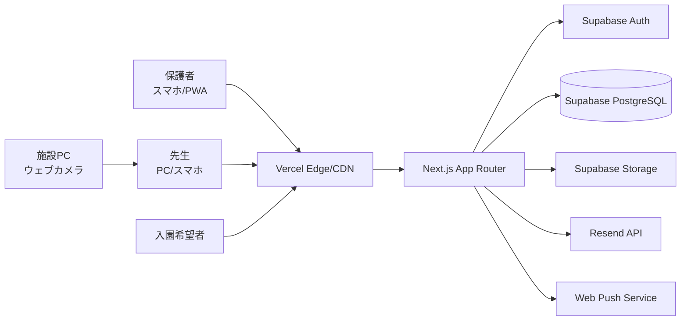
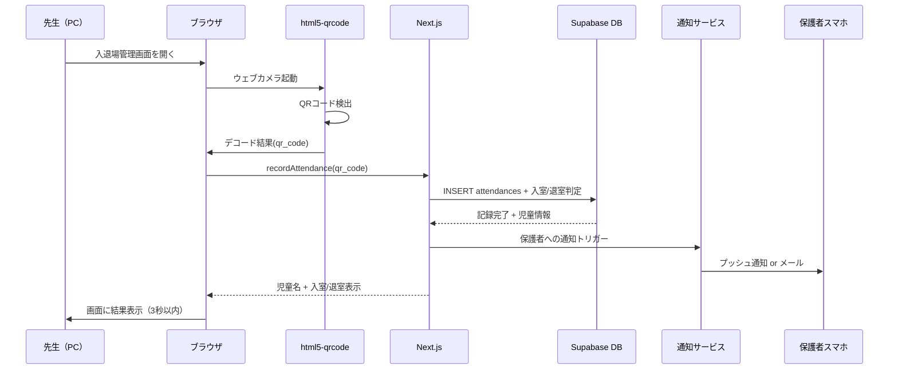
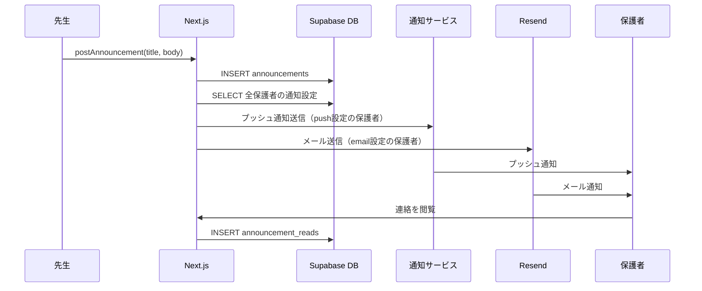
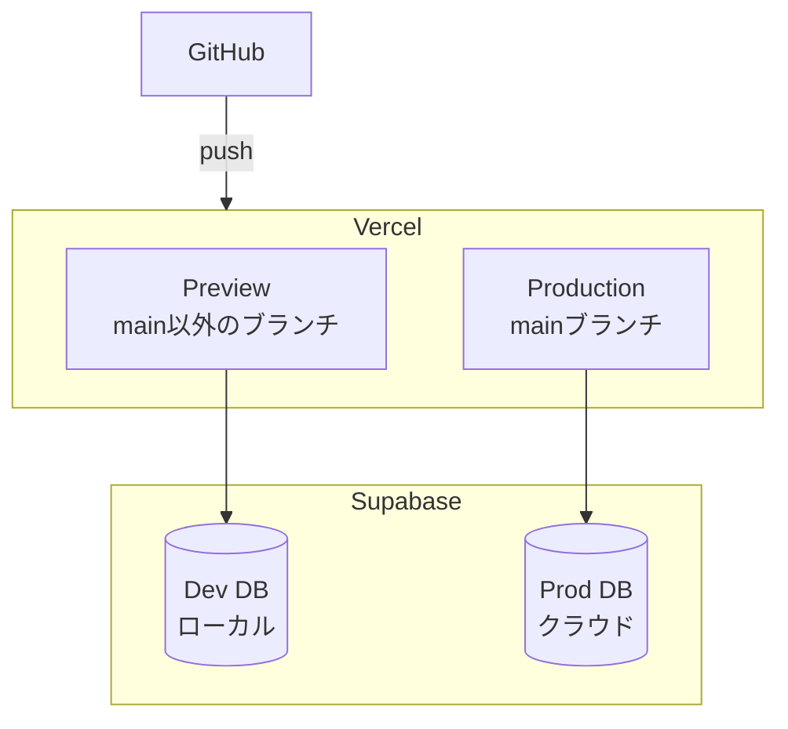

# Architecture — gakudo

## 1. System overview

gakudoは、Next.js App Routerベースのフルスタックアプリケーションで、Supabase（PostgreSQL + Auth + Storage）をバックエンドに、Vercelにデプロイする。保護者はスマホのブラウザ（PWA）から、先生はPC/スマホから、入園希望者は公開HPから利用する。QRコードの読取はクライアントサイドで完結し、入退場データはSupabase DBに記録される。



## 2. Components

### 2.1 Public Site（公開HP）
- **責務:** 入園希望者向けの施設情報・お知らせ・公開写真を表示
- **Tech:** Next.js SSG (Static Site Generation)
- **依存:** Supabase DB (SitePage, SiteNews), Supabase Storage (公開写真)
- **配置:** `src/app/(public)/`

### 2.2 Auth Module（認証）
- **責務:** ログイン、招待、パスワードリセット、セッション管理
- **Tech:** Supabase Auth + Next.js Middleware
- **依存:** Supabase Auth, Resend (招待メール)
- **配置:** `src/app/(auth)/`, `src/lib/supabase/`

### 2.3 Dashboard（保護者/先生共通）
- **責務:** ロール別ダッシュボード表示、ナビゲーション
- **Tech:** Next.js App Router (Server Components + Client Components)
- **依存:** Auth Module, Supabase DB
- **配置:** `src/app/(dashboard)/`

### 2.4 Attendance Module（入退場管理）
- **責務:** QR読取、手動入力、入退場記録、履歴閲覧
- **Tech:** html5-qrcode (クライアント), Supabase DB, Supabase Realtime
- **依存:** Auth Module, Notification Module, Child Registry
- **配置:** `src/app/(dashboard)/attendance/`, `src/components/qr/`

### 2.5 Child Registry（児童管理）
- **責務:** 児童登録、保護者紐付け、QRコード発行
- **Tech:** react-qr-code, Supabase DB
- **依存:** Auth Module
- **配置:** `src/app/(dashboard)/children/`

### 2.6 Announcement Module（連絡事項）
- **責務:** 連絡配信、既読管理、資料掲示板
- **Tech:** Next.js Server Actions, Supabase DB
- **依存:** Auth Module, Notification Module
- **配置:** `src/app/(dashboard)/announcements/`, `src/app/(dashboard)/documents/`

### 2.7 Photo Module（写真共有）
- **責務:** 写真アップロード・圧縮・閲覧・公開/非公開管理
- **Tech:** browser-image-compression, Supabase Storage, Supabase DB
- **依存:** Auth Module
- **配置:** `src/app/(dashboard)/photos/`

### 2.8 Billing Module（請求管理）
- **責務:** 延長保育ルール設定、料金自動計算、月次請求確認、CSVエクスポート
- **Tech:** Next.js Server Actions, Supabase DB
- **依存:** Attendance Module, Auth Module, Notification Module
- **配置:** `src/app/(dashboard)/billing/`

### 2.9 Notification Module（通知）
- **責務:** プッシュ通知・メール通知の送信、通知設定管理
- **Tech:** Web Push API + web-push (サーバー), Resend (メール)
- **依存:** Auth Module
- **配置:** `src/lib/notifications/`, `src/app/api/push/`
- **ADR:** ADR-0001

## 3. Data model

### Entities

```sql
-- ユーザー（Supabase Auth管理 + profilesテーブル）
CREATE TABLE profiles (
  id UUID PRIMARY KEY REFERENCES auth.users(id) ON DELETE CASCADE,
  email TEXT NOT NULL,
  name TEXT NOT NULL,
  role TEXT NOT NULL CHECK (role IN ('parent', 'teacher', 'admin')),
  created_at TIMESTAMPTZ DEFAULT now(),
  updated_at TIMESTAMPTZ DEFAULT now()
);

-- 児童
CREATE TABLE children (
  id UUID PRIMARY KEY DEFAULT gen_random_uuid(),
  name TEXT NOT NULL,
  grade INTEGER NOT NULL CHECK (grade BETWEEN 1 AND 6),
  qr_code TEXT UNIQUE NOT NULL,
  qr_active BOOLEAN DEFAULT true,
  created_at TIMESTAMPTZ DEFAULT now(),
  updated_at TIMESTAMPTZ DEFAULT now()
);

-- 児童⇔保護者の紐付け（N:N）
CREATE TABLE child_parents (
  child_id UUID REFERENCES children(id) ON DELETE CASCADE,
  parent_id UUID REFERENCES profiles(id) ON DELETE CASCADE,
  PRIMARY KEY (child_id, parent_id)
);

-- 入退場記録
CREATE TABLE attendances (
  id UUID PRIMARY KEY DEFAULT gen_random_uuid(),
  child_id UUID NOT NULL REFERENCES children(id) ON DELETE CASCADE,
  type TEXT NOT NULL CHECK (type IN ('enter', 'exit')),
  method TEXT NOT NULL CHECK (method IN ('qr', 'manual')),
  recorded_at TIMESTAMPTZ DEFAULT now(),
  recorded_by UUID REFERENCES profiles(id)
);
CREATE INDEX idx_attendances_child_date ON attendances (child_id, recorded_at);

-- 連絡事項
CREATE TABLE announcements (
  id UUID PRIMARY KEY DEFAULT gen_random_uuid(),
  title TEXT NOT NULL,
  body TEXT NOT NULL,
  posted_by UUID NOT NULL REFERENCES profiles(id),
  created_at TIMESTAMPTZ DEFAULT now()
);

-- 連絡既読
CREATE TABLE announcement_reads (
  announcement_id UUID REFERENCES announcements(id) ON DELETE CASCADE,
  user_id UUID REFERENCES profiles(id) ON DELETE CASCADE,
  read_at TIMESTAMPTZ DEFAULT now(),
  PRIMARY KEY (announcement_id, user_id)
);

-- 写真
CREATE TABLE photos (
  id UUID PRIMARY KEY DEFAULT gen_random_uuid(),
  storage_path TEXT NOT NULL,
  thumbnail_path TEXT,
  caption TEXT,
  event_name TEXT,
  visibility TEXT NOT NULL DEFAULT 'private' CHECK (visibility IN ('private', 'public')),
  uploaded_by UUID NOT NULL REFERENCES profiles(id),
  created_at TIMESTAMPTZ DEFAULT now()
);

-- 資料
CREATE TABLE documents (
  id UUID PRIMARY KEY DEFAULT gen_random_uuid(),
  title TEXT NOT NULL,
  file_path TEXT NOT NULL,
  category TEXT NOT NULL,
  uploaded_by UUID NOT NULL REFERENCES profiles(id),
  created_at TIMESTAMPTZ DEFAULT now()
);

-- 延長保育料金ルール
CREATE TABLE billing_rules (
  id UUID PRIMARY KEY DEFAULT gen_random_uuid(),
  regular_end_time TIME NOT NULL,
  rate_per_unit INTEGER NOT NULL,
  unit_minutes INTEGER NOT NULL DEFAULT 30,
  effective_from DATE NOT NULL,
  created_by UUID NOT NULL REFERENCES profiles(id),
  created_at TIMESTAMPTZ DEFAULT now()
);

-- 月次請求
CREATE TABLE monthly_bills (
  id UUID PRIMARY KEY DEFAULT gen_random_uuid(),
  child_id UUID NOT NULL REFERENCES children(id),
  year_month TEXT NOT NULL,
  total_extended_minutes INTEGER NOT NULL DEFAULT 0,
  total_amount INTEGER NOT NULL DEFAULT 0,
  status TEXT NOT NULL DEFAULT 'draft' CHECK (status IN ('draft', 'confirmed')),
  confirmed_at TIMESTAMPTZ,
  confirmed_by UUID REFERENCES profiles(id),
  created_at TIMESTAMPTZ DEFAULT now(),
  UNIQUE (child_id, year_month)
);

-- 公開HP - ページ
CREATE TABLE site_pages (
  id UUID PRIMARY KEY DEFAULT gen_random_uuid(),
  slug TEXT UNIQUE NOT NULL,
  title TEXT NOT NULL,
  content TEXT NOT NULL,
  updated_at TIMESTAMPTZ DEFAULT now(),
  updated_by UUID REFERENCES profiles(id)
);

-- 公開HP - お知らせ
CREATE TABLE site_news (
  id UUID PRIMARY KEY DEFAULT gen_random_uuid(),
  title TEXT NOT NULL,
  body TEXT NOT NULL,
  published_at TIMESTAMPTZ DEFAULT now(),
  created_by UUID REFERENCES profiles(id)
);

-- 通知設定
CREATE TABLE notification_preferences (
  user_id UUID PRIMARY KEY REFERENCES profiles(id) ON DELETE CASCADE,
  method TEXT NOT NULL DEFAULT 'email' CHECK (method IN ('push', 'email', 'both', 'off'))
);

-- プッシュ通知サブスクリプション
CREATE TABLE push_subscriptions (
  id UUID PRIMARY KEY DEFAULT gen_random_uuid(),
  user_id UUID NOT NULL REFERENCES profiles(id) ON DELETE CASCADE,
  subscription JSONB NOT NULL,
  created_at TIMESTAMPTZ DEFAULT now()
);
```

### Relationships
- User (profiles) 1:N Child (via child_parents N:N)
- Child 1:N Attendance
- User (teacher) 1:N Announcement
- Announcement N:N User (via announcement_reads)
- Child 1:N MonthlyBill
- BillingRule: 最新のeffective_from <= 現在日のレコードが有効ルール

### Migrations policy
- Supabase CLIのマイグレーション機能を使用（forward-only）
- シードデータ: 管理者アカウント1件 + サンプルデータ（開発環境のみ）

## 4. API surface

Next.js App RouterのServer ActionsとAPI Routesを使用。Supabase ClientのRPC呼び出しも活用。

| Method | Path | Auth | 説明 |
|--------|------|------|------|
| POST | `/api/auth/invite` | admin | ユーザー招待メール送信 |
| POST | `/api/push/subscribe` | authenticated | プッシュ通知サブスクリプション登録 |
| POST | `/api/push/send` | internal | プッシュ通知送信（内部） |
| GET | `/api/attendance/export` | admin | 入退場CSV出力 |
| POST | `/api/billing/calculate` | admin/teacher | 月次請求一括計算 |
| — | Server Actions | — | — |
| — | `createChild` | admin | 児童登録 |
| — | `linkParent` | admin | 保護者紐付け |
| — | `generateQR` | admin | QRコード発行/再発行 |
| — | `recordAttendance` | teacher | 入退場記録（QR/手動） |
| — | `postAnnouncement` | teacher | 連絡事項投稿 |
| — | `markRead` | parent | 連絡既読マーク |
| — | `uploadPhoto` | teacher | 写真アップロード |
| — | `setPhotoVisibility` | admin | 写真公開/非公開切替 |
| — | `uploadDocument` | teacher | 資料アップロード |
| — | `updateBillingRule` | admin | 料金ルール更新 |
| — | `confirmBill` | teacher | 請求確定 |
| — | `updateSitePage` | admin | HP編集 |
| — | `createSiteNews` | admin | お知らせ追加 |

## 5. Data flow

### 入退場記録フロー（コア）


### 連絡配信フロー


## 6. Cross-cutting concerns

### Auth
- Supabase Authのセッションベース認証（JWT）
- Next.js MiddlewareでJWTを検証、未認証は`/login`にリダイレクト
- セッション有効期間: 7日（refresh token自動更新）
- ログアウト: Supabase `signOut()` → cookie削除

### Authorization
- **RLS (Row Level Security)** をSupabase PostgreSQLで設定
- 保護者: 自分の子供の入退場・請求のみ閲覧可能
- 先生: 全児童の入退場記録・連絡投稿が可能
- 管理者: 全操作可能
- ポリシーはDB層で一元管理（ADR-0002）

### Logging
- Next.js APIルートでの構造化ログ（JSON形式）
- 必須フィールド: timestamp, userId, action, resourceId

### Error handling
- Server Actionsでエラーをキャッチし、ユーザー向けメッセージに変換
- 入退場記録のエラーはエラー音＋画面表示で即座にフィードバック

### Config
- 環境変数: `.env.local`で管理
- 必須: `NEXT_PUBLIC_SUPABASE_URL`, `NEXT_PUBLIC_SUPABASE_ANON_KEY`, `SUPABASE_SERVICE_ROLE_KEY`, `RESEND_API_KEY`, `VAPID_PUBLIC_KEY`, `VAPID_PRIVATE_KEY`

## 7. Deployment topology



- **開発:** `supabase start`でローカルDB + `next dev`
- **Preview:** PRごとにVercel Preview Deployment
- **本番:** mainマージでVercel自動デプロイ、Supabaseクラウド接続
- **ロールバック:** Vercelの即時ロールバック機能

## 8. Non-functional posture

| NFR | Target | アーキテクチャの回答 |
|-----|--------|---------------------|
| LCP 2.5秒以内 | 3G回線 | Vercel Edge CDN + SSG（公開HP）+ Server Components |
| QR読取3秒以内 | PC | クライアントサイド完結（サーバー往復なし）+ DB書込は非同期表示後 |
| 通知60秒以内 | 入退場 | Server Action内で非同期通知トリガー |
| 可用性99.5% | 月間 | Vercel + Supabase のマネージドSLA |
| 同時接続34人 | 30親+3先生+1管理者 | Supabaseの無料枠で十分（500接続） |
| セキュリティ | パスワード | bcrypt (Supabase Auth標準)、httpOnly cookie、HTTPS |
| プライバシー | 写真 | RLSで認証済みユーザーのみ、Supabase Storage policy |
| ストレージ | 5GB目標 | 画像圧縮500KB以下 + 容量監視アラート |

## 9. Open questions
1. Supabase無料プランの非アクティブpause対策（cron ping等）
2. 写真ストレージが1GBを超えた場合の移行計画（R2併用 or 有料プラン）
3. Web Push通知のVAPIDキー管理方法

## 10. ADRs
- ADR-0001: 通知のCompose戦略（Push + Email）
- ADR-0002: 認可をRLSで一元管理する
- ADR-0003: QRコード読取をクライアントサイドで完結させる
