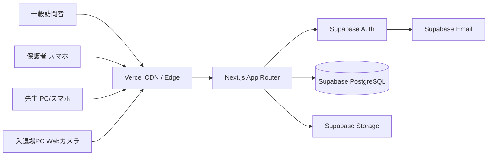
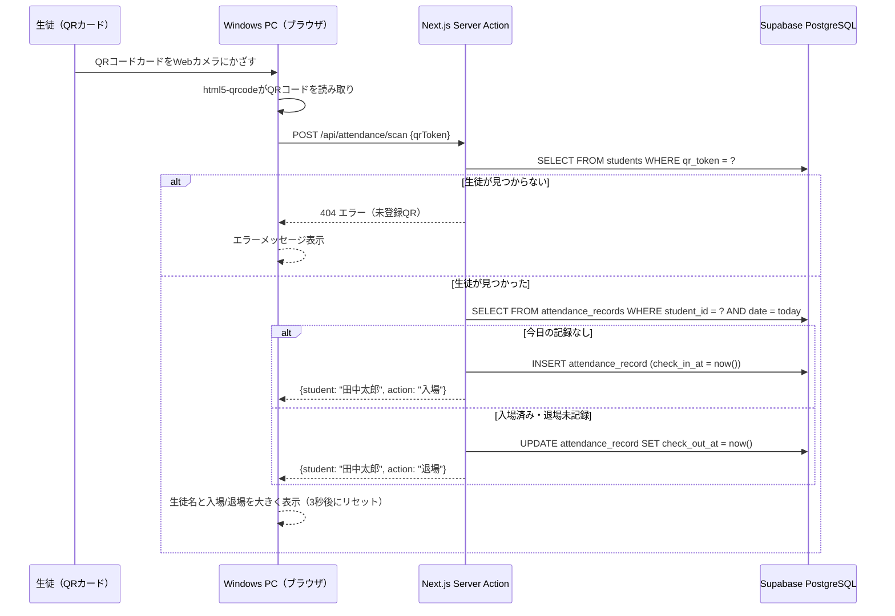
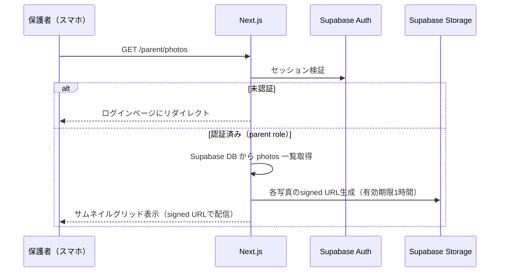
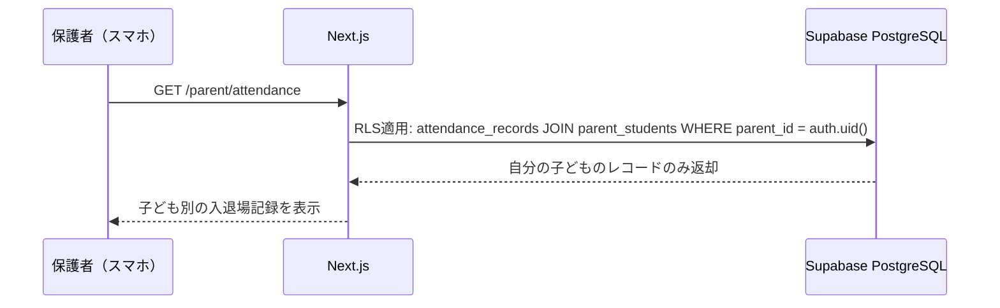
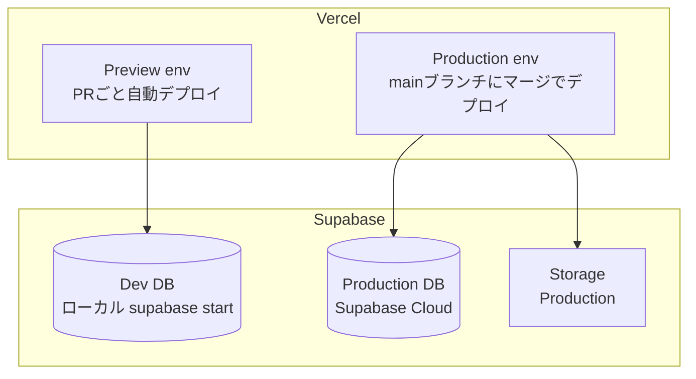

# Architecture — 学童保育Webアプリ（がくどう）

## 1. System overview

本アプリはNext.js (App Router) をフロントエンド兼BFFとし、Supabaseをバックエンド（認証・DB・ストレージ・メール）として利用するサーバーレスアーキテクチャ。公開HPページはISR（Incremental Static Regeneration）で配信し、認証が必要なページはSSR + クライアントサイドで動的にレンダリングする。入退場記録画面はWindowsノートPCのブラウザで全画面表示し、Webカメラ経由でQRコードを読み取る。



## 2. Components

### 2.1 Public Pages（公開HP）
- **Responsibility**: 施設紹介・説明会案内・お知らせの表示
- **Tech**: Next.js ISR（revalidate: 3600）
- **Depends on**: Supabase DB（PublicNotice テーブル）
- **Source**: `src/app/(public)/`

### 2.2 Auth Module（認証）
- **Responsibility**: ログイン・ログアウト・パスワードリセット・セッション管理
- **Tech**: Supabase Auth + Next.js Middleware
- **Depends on**: Supabase Auth
- **Source**: `src/app/(auth)/`, `src/middleware.ts`

### 2.3 Teacher Dashboard（先生用管理画面）
- **Responsibility**: 生徒管理、保護者アカウント作成、連絡事項登録、写真アップロード、入退場履歴閲覧
- **Tech**: Next.js Server Components + Client Components
- **Depends on**: Auth Module, Supabase DB, Supabase Storage
- **Source**: `src/app/(protected)/teacher/`

### 2.4 Parent Dashboard（保護者用画面）
- **Responsibility**: 連絡事項閲覧、写真閲覧、子どもの入退場履歴確認
- **Tech**: Next.js Server Components + Client Components
- **Depends on**: Auth Module, Supabase DB (RLS filtered)
- **Source**: `src/app/(protected)/parent/`

### 2.5 Attendance Scanner（入退場記録画面）
- **Responsibility**: QRコードをWebカメラで読み取り、入退場を記録
- **Tech**: Client Component + html5-qrcode ライブラリ
- **Depends on**: Auth Module (teacher role), Supabase DB
- **Source**: `src/app/(protected)/teacher/attendance/scan/`
- **ADR**: ADR-0001

### 2.6 QR Card Generator（QRカード生成）
- **Responsibility**: 生徒ごとのQRコード生成とカード用PDF出力
- **Tech**: qrcode（生成）+ jsPDF（PDF出力）、クライアントサイド
- **Depends on**: Supabase DB (Student)
- **Source**: `src/app/(protected)/teacher/students/`
- **ADR**: ADR-0002

### 2.7 Photo Manager（写真管理）
- **Responsibility**: 写真のアップロード・リサイズ・サムネイル生成・閲覧
- **Tech**: Supabase Storage + Next.js Image optimization
- **Depends on**: Auth Module, Supabase Storage (RLS)
- **Source**: `src/app/(protected)/teacher/photos/`, `src/app/(protected)/parent/photos/`
- **ADR**: ADR-0003

## 3. Data model

### Entities

#### profiles
Supabase Authの`auth.users`と1:1で紐付くプロフィールテーブル。

| Column | Type | Constraints |
|--------|------|------------|
| id | uuid | PK, FK → auth.users.id |
| email | text | NOT NULL, UNIQUE |
| name | text | NOT NULL |
| role | text | NOT NULL, CHECK ('teacher', 'parent') |
| created_at | timestamptz | NOT NULL, DEFAULT now() |

#### students

| Column | Type | Constraints |
|--------|------|------------|
| id | uuid | PK, DEFAULT gen_random_uuid() |
| name | text | NOT NULL |
| class_name | text | |
| qr_token | text | NOT NULL, UNIQUE (UUIDv4) |
| created_at | timestamptz | NOT NULL, DEFAULT now() |

Index: `idx_students_qr_token` on `qr_token`

#### parent_students (many-to-many)

| Column | Type | Constraints |
|--------|------|------------|
| parent_id | uuid | FK → profiles.id, ON DELETE CASCADE |
| student_id | uuid | FK → students.id, ON DELETE CASCADE |

PK: (parent_id, student_id)

#### attendance_records

| Column | Type | Constraints |
|--------|------|------------|
| id | uuid | PK, DEFAULT gen_random_uuid() |
| student_id | uuid | FK → students.id, NOT NULL |
| date | date | NOT NULL |
| check_in_at | timestamptz | NOT NULL |
| check_out_at | timestamptz | NULL |

Index: `idx_attendance_student_date` on (student_id, date)
Unique constraint: `uniq_attendance_student_date` on (student_id, date) — 1日1レコード

#### announcements

| Column | Type | Constraints |
|--------|------|------------|
| id | uuid | PK, DEFAULT gen_random_uuid() |
| title | text | NOT NULL |
| body | text | NOT NULL |
| author_id | uuid | FK → profiles.id, NOT NULL |
| created_at | timestamptz | NOT NULL, DEFAULT now() |
| updated_at | timestamptz | NOT NULL, DEFAULT now() |

Index: `idx_announcements_created_at` on created_at DESC

#### photos

| Column | Type | Constraints |
|--------|------|------------|
| id | uuid | PK, DEFAULT gen_random_uuid() |
| storage_path | text | NOT NULL |
| thumbnail_path | text | NOT NULL |
| uploaded_by | uuid | FK → profiles.id, NOT NULL |
| created_at | timestamptz | NOT NULL, DEFAULT now() |

Index: `idx_photos_created_at` on created_at DESC

#### public_notices (HP用お知らせ)

| Column | Type | Constraints |
|--------|------|------------|
| id | uuid | PK, DEFAULT gen_random_uuid() |
| title | text | NOT NULL |
| body | text | NOT NULL |
| published_at | timestamptz | NOT NULL, DEFAULT now() |
| author_id | uuid | FK → profiles.id, NOT NULL |

Index: `idx_public_notices_published_at` on published_at DESC

### Relationships

```
auth.users 1:1 profiles
profiles (parent) N:N students (via parent_students)
students 1:N attendance_records
profiles (teacher) 1:N announcements
profiles (teacher) 1:N photos
profiles (teacher) 1:N public_notices
```

### Migrations policy
- Supabase Migrations（SQL）で管理。forward-only。
- 開発環境は `supabase db reset` でシードデータから再構築。
- シードスクリプトで初期管理者アカウント（先生）を1つ作成。

## 4. API surface

Supabaseクライアントを使ってPostgRESTエンドポイントを直接呼び出す。カスタムAPIはNext.js Route Handlers（Server Actions）で実装。

| Method | Path / Op | Auth | Request | Response | Notes |
|--------|-----------|------|---------|----------|-------|
| POST | supabase.auth.signInWithPassword | public | {email, password} | session | ログイン |
| POST | supabase.auth.resetPasswordForEmail | public | {email} | void | パスワードリセットメール送信 |
| POST | supabase.auth.updateUser | session | {password} | user | パスワード更新 |
| GET | /api/students | teacher | - | Student[] | 生徒一覧 |
| POST | /api/students | teacher | {name, className} | Student | 生徒登録 |
| PATCH | /api/students/:id | teacher | {name?, className?} | Student | 生徒編集 |
| POST | /api/parents | teacher | {email, password, studentIds} | Profile | 保護者アカウント作成 |
| GET | /api/attendance?date= | teacher | query: date | AttendanceRecord[] | 入退場履歴（全生徒） |
| GET | /api/attendance/my | parent | - | AttendanceRecord[] | 入退場履歴（自分の子のみ、RLS） |
| POST | /api/attendance/scan | teacher | {qrToken} | {student, action} | QRスキャン → 入退場記録 |
| GET | /api/announcements | session | - | Announcement[] | 連絡事項一覧 |
| POST | /api/announcements | teacher | {title, body} | Announcement | 連絡事項登録 |
| PATCH | /api/announcements/:id | teacher | {title?, body?} | Announcement | 連絡事項編集 |
| POST | /api/photos/upload | teacher | FormData (files) | Photo[] | 写真アップロード |
| GET | /api/photos | session | - | Photo[] | 写真一覧 |
| GET | /api/public-notices | public | - | PublicNotice[] | 公開お知らせ一覧 |
| POST | /api/public-notices | teacher | {title, body} | PublicNotice | お知らせ登録 |

## 5. Data flow

### QRコード入退場記録（US-7、最重要フロー）



### 写真閲覧（US-13、セキュリティ重要フロー）



### 保護者の入退場確認（US-9）



## 6. Cross-cutting concerns

### Auth
- **方式**: Supabase Auth（メール+パスワード）
- **セッション**: Supabase が発行するJWT。Next.js Middleware でサーバーサイド検証
- **トークン保存**: httpOnly cookie（`@supabase/ssr` が管理）
- **リフレッシュ**: Supabase SDK が自動リフレッシュ（デフォルト1時間ごと）
- **ログアウト**: `supabase.auth.signOut()` でセッション無効化

### Authorization
- **ロールモデル**: `profiles.role` = 'teacher' | 'parent'
- **ポリシー適用箇所**:
  - DB層: Supabase RLS ポリシー（保護者は自分の子どもの attendance_records のみ）
  - アプリ層: Next.js Middleware でロール別ルーティング保護
  - API層: Server Actions / Route Handlers でロールチェック
- **ADR**: ADR-0004

### Logging
- Vercel のビルトインログ（`console.log` → Vercel Logs）
- 構造化ログはv1では不要。エラー時に `console.error` で十分

### Observability
- Vercel Analytics（無料枠: Web Vitals）
- エラー追跡はv1ではVercel Logsで対応。Sentryはv2で検討

### Config
- 環境変数: `NEXT_PUBLIC_SUPABASE_URL`, `NEXT_PUBLIC_SUPABASE_ANON_KEY`, `SUPABASE_SERVICE_ROLE_KEY`
- `.env.local` で管理。`.env.example` をリポジトリに含める
- サービスロールキーはサーバーサイドのみ使用（保護者アカウント作成用）

### Error handling
- Server Actions: try/catch で Supabase エラーをキャッチ、ユーザーフレンドリーなメッセージに変換
- クライアント: React Error Boundary でフォールバックUI表示
- QR読み取りエラー: 画面に大きくエラー表示（子どもが理解できるシンプルな文言）

### Rate limiting
- Supabase Auth のビルトインレート制限（ログイン試行）
- v1では追加のレート制限は不要（50ユーザー規模）

## 7. Deployment topology



- **ローカル開発**: `supabase start`（Docker）で DB・Auth・Storage をローカル起動
- **Preview**: Vercel Preview + Supabase Dev DB（またはPreviewブランチ）
- **Production**: Vercel Production + Supabase Cloud
- **CI/CD**: GitHub → Vercel 自動デプロイ。Supabase Migrations は `supabase db push` で適用
- **ロールバック**: Vercel のInstant Rollback。DB はforward-onlyマイグレーション

## 8. Non-functional posture

| NFR | Target | How the architecture meets it |
|-----|--------|-------------------------------|
| レスポンス時間 < 2秒 | ページ表示 2秒以内 | 公開HPはISRでCDNキャッシュ。認証ページはSSR + Supabase同一リージョン |
| 同時接続 50 | 50ユーザー | Vercel Serverless Functions はリクエスト単位でスケール。Supabase Free は500接続 |
| 可用性 99% | 月間ダウンタイム7時間以内 | Vercel SLA 99.99%、Supabase Free は SLA なし（実績上 99%+） |
| 写真ストレージ | 1枚5MB以下、リサイズ | アップロード時にクライアントサイドでリサイズ（長辺1920px）。Supabase Storage 1GB |
| セキュリティ | パスワードハッシュ、HTTPS | Supabase Auth（bcrypt）、Vercel 自動SSL。写真はsigned URL |
| レスポンシブ | 375px以上 | CSS media queries。入退場画面はPC全画面レイアウト |
| データ保持 | 入退場1年、写真は無期限 | PostgreSQL + Storage。容量上限到達前に有料プラン検討 |

## 9. Open questions

1. Supabase Free Tier の Storage 1GB で写真何枚程度保存可能か？（リサイズ後1枚300KB想定 → 約3,000枚）
2. 入退場で「退場後に再入場」するケース（忘れ物を取りに戻る等）の運用ルールは？
3. 年度替わり時のデータ移行・アーカイブ方針は？

## 10. ADRs

- [ADR-0001: QRコード読み取りライブラリの選定](./adr/0001-qr-reader-library.md)
- [ADR-0002: QRカードPDF生成をクライアントサイドで行う](./adr/0002-client-side-pdf-generation.md)
- [ADR-0003: 写真のアクセス制御にSigned URLを使用する](./adr/0003-photo-access-signed-url.md)
- [ADR-0004: 認可の多層防御（RLS + Middleware + Server Actions）](./adr/0004-multi-layer-authorization.md)
